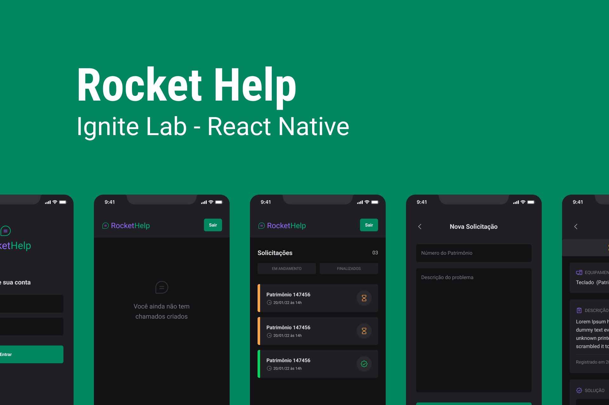

<h1 align="center">
    
</h1>

<h4 align="center">

  **Aplicação mobile desenvolvida em React Native, utilizando Typescript.**

  *Desenvolvida durante o evento Ignite Lab 03 promovido pela [Rocketseat][rocketseat].*

</h4>

  <a href="#summary">Summary</a>&nbsp;&nbsp;&nbsp;|&nbsp;&nbsp;&nbsp;
  <a href="#techs">Techs</a>&nbsp;&nbsp;&nbsp;|&nbsp;&nbsp;&nbsp;
  <a href="#layout">Layout</a>

## Sumary

O RocketHelp é uma aplicativo para controle de chamados. O famoso "Help desk".

Nele, usuários previamente cadastrados (pois o app não trata de criação de usuários), solicitão auxílio por meio de abertura de um chamado para solucionar algum tipo de problema.

E ainda, é possível tratar da solução e finalizar o chamado por meio do app.

## Techs

O RocketHelp foi desenvolvido em [React Native][react-native] utilizando [Typescript][typescript].

Foi utilizada a lib [Native Base][native-base] para construção dos layouts. Essa que é uma lib de construção de layouts declarativa.

Ainda, foram utilizadas lib como: [react-native-svg-transformer][rn-svg], [phosphoricons][phosphoricons], [React Navigation][react-navigation].

Para o backend, foi utilizado o [Firebase][firebase].

## Layout

Layout usado como base para o desenvolvimento feito no Figma.

[Acesse aqui][figma]

---

Feito por Patrick Thomaz :wave: [Get in touch!](https://www.linkedin.com/in/patrick-thomaz/)

[rocketseat]: https://www.rocketseat.com.br/

[react-native]: https://reactnative.dev/
[typescript]: https://www.typescriptlang.org/
[native-base]: https://nativebase.io/
[rn-svg]: https://github.com/kristerkari/react-native-svg-transformer
[phosphoricons]: https://phosphoricons.com/
[react-navigation]: https://reactnavigation.org
[firebase]: https://firebase.google.com/
[figma]: https://www.figma.com/file/YeibaILVlt5ACNkSnqjLPt/Ignite-Lab-de-React-Native-20k22?node-id=47%3A273